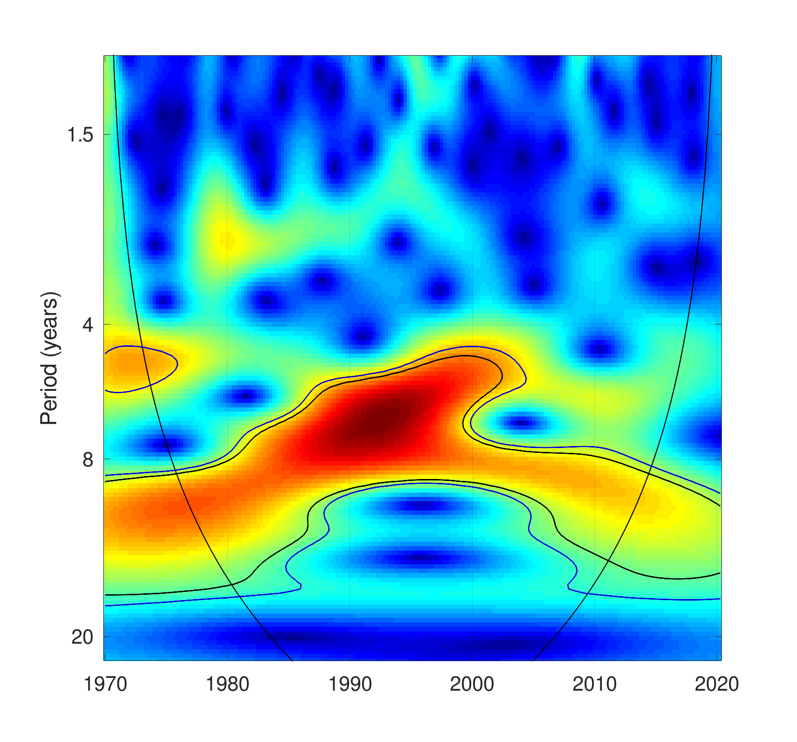

# QE-wavelet-analysis

Octave/Matlab code from my diploma thesis _Wavelet analysis of quantitative easing in Japan_ ([local PDF](WaveletThesis.pdf), [external link](https://opac.crzp.sk/?fn=detailBiblioForm&sid=FE42652C724A629CC7654024874B)).

Octave code in this repo relies on proprietary [ASToolbox2018](https://sites.google.com/site/aguiarconraria/wavelets-and-economics/the-astoolbox) to be used.
To run ASToolbox2018 in Octave you have to omit `’Edgecolor’,[.7 .7 .7]` option from the `contour()` function. If you want to use `xlsread()` function, you need to load io package by writing `pkg load io` in your script.
In case it is not already installed, type `pkg install -forge io` in the command window.
Beside that, ASToolbox2018 works just fine in Octave and produces output virtually identical to that of Matlab.

Available scripts are:

- `Common.m`: common Code for all scripts
- `PowerSpectrum.m`: wavelet power spectrum
- `Coherency.m`: wavelet coherency phase-difference and gains
- `Multiple.m`: multiple wavelet coherency
- `Partial.m`: partial wavelet coherency
- `Partial_PhaseDiff.m`: partial wavelet coherency phase-difference and gains

To make thesis results reproducible `data.csv` is also included:

- `fx`: [BOJ Time-Series Data Search](https://www.stat-search.boj.or.jp/index_en.html), `FM09'FX180110002` (Real/Effective Exchange Rates)
- `reserve`: [BOJ Time-Series Data Search](https://www.stat-search.boj.or.jp/index_en.html), `MD01'MABS1AA11X12` (Monetary Base/Seasonally Adjusted (X-12-ARIMA)/Average Amounts Outstanding)
- `GDP`: [data IMF](https://data.imf.org/regular.aspx?key=61545852), Gross Domestic Product and Components selected indicators
- `CPI`: [Statistics of Japan](https://www.e-stat.go.jp/en/dbview?sid=0003143513), Consumer Price Index 2015-Base Consumer Price Index

For more information see my [thesis](WaveletThesis.pdf).

